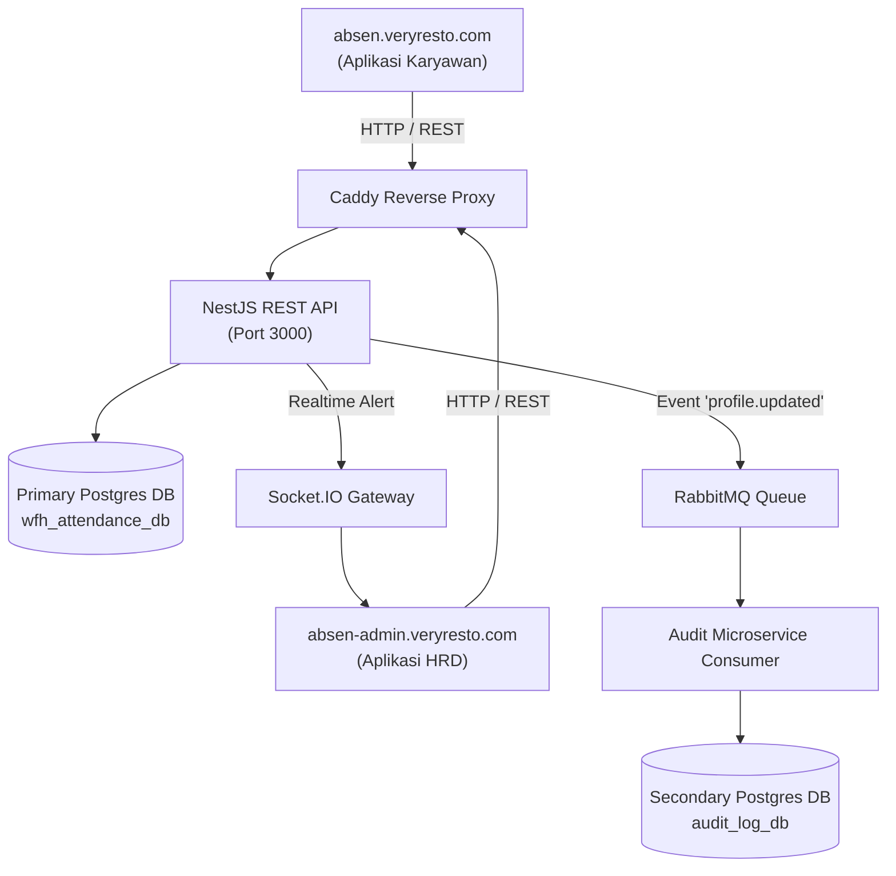

# VeryResto Fullstack Employee WFH Attendance & HR Monitoring System

Sistem Manajemen Absensi WFH Karyawan dan Monitoring HRD berbasis Microservices, NestJS, React.js, PostgreSQL, RabbitMQ, dan Socket.IO.

Sistem ini dapat diakses secara langsung melalui domain:
- **`https://absen.veryresto.com`** (Aplikasi WFH Karyawan)
- **`https://absen-admin.veryresto.com`** (Aplikasi Monitoring HRD)
- **`https://absen-api.veryresto.com`** (REST API dan Socket.IO)

---

## 📋 Fitur Utama

### A. Aplikasi Absensi WFH Karyawan (`absen.veryresto.com`)
1. **Profil Karyawan**:
   - Menampilkan Nama, Email, Foto, Posisi, dan No. HP.
   - Mengubah Foto, No. HP, dan Password.
   - **Realtime Admin Alert**: Notifikasi instan via WebSockets ke aplikasi Admin HRD saat terjadi perubahan data profil.
   - **Data Stream / Message Queue**: Logging audit ke database sekunder terpisah via RabbitMQ.
2. **Absen**:
   - Fitur Absen Masuk dan Absen Pulang kantor secara WFH dengan pencatatan Tanggal, Waktu, dan Status.
3. **Summary Absen**:
   - Menampilkan ringkasan kehadiran (Default: Awal Bulan s/d Hari ini).
   - Filter tanggal (*From - To*) dan tombol pencarian ("Cari").
   - Tampilan responsif: tabel pada desktop dan daftar ringkas pada perangkat mobile.

### B. Aplikasi Monitoring Karyawan HRD (`absen-admin.veryresto.com`)
1. **Real-time Profile Alert**: Popup/Toast Notifikasi otomatis muncul di layar Admin secara instant saat ada karyawan yang mengubah profil.
2. **Kelola Data Karyawan**: Tambah karyawan baru dan perbarui informasi karyawan existing.
3. **Monitoring Absensi (Read-Only)**: Melihat seluruh rekapan absensi masuk & pulang semua karyawan dengan filter tanggal dan nama.
4. **Audit Log Queue Stream**: Melihat log aktivitas perubahan profil yang ditangkap dari RabbitMQ di secondary database.

Tabel operasional pada aplikasi HRD ditampilkan sebagai daftar record ringkas pada perangkat mobile agar informasi dan tindakan tetap mudah digunakan tanpa horizontal scrolling.

---

## 🔑 Kredensial Login Default

| Role | Domain | Email | Password |
|------|--------|-------|----------|
| **Admin HRD** | `absen-admin.veryresto.com` | `hr.admin@veryresto.com` | `Password321!!` |
| **Karyawan 1** | `absen.veryresto.com` | `budi.santoso@veryresto.com` | `Password321!!` |
| **Karyawan 2** | `absen.veryresto.com` | `siti.aminah@veryresto.com` | `Password321!!` |


---

## 🏗 Arsitektur Sistem



> 📖 **Dokumentasi Lengkap:**
> - [Dokumentasi Database & Schema ERD](docs/database.md)
> - [Dokumentasi Arsitektur Microservices & Flow](docs/architecture.md)

---

## 🛠 Panduan Jalankan Aplikasi

### Menjalankan Seluruh Stack dengan Docker Compose (Disarankan)

Seluruh aplikasi dan infrastrukturnya dikelola oleh satu Compose project:

Salin konfigurasi domain, lalu sesuaikan nilainya sebelum build pertama:

```bash
cp .env.example .env
```

`EMPLOYEE_DOMAIN`, `ADMIN_DOMAIN`, dan `API_DOMAIN` digunakan oleh Caddy.
`VITE_API_BASE_URL` dan `VITE_BACKEND_URL` ditanam ke build frontend, sehingga
perubahan kedua nilai tersebut memerlukan rebuild `employee-web` dan `admin-web`.

```bash
# Build image dan jalankan seluruh service
docker compose up -d --build

# Lihat status
docker compose ps

# Ikuti log seluruh service
docker compose logs -f

# Restart satu service tanpa membangun ulang image
docker compose restart api
docker compose restart employee-web
docker compose restart admin-web

# Stop tanpa menghapus container/data
docker compose stop

# Jalankan kembali container yang sudah dihentikan
docker compose start

# Hentikan dan hapus container/network; volume database tetap tersimpan
docker compose down
```

Setelah mengubah source code, rebuild dan recreate service terkait. `docker compose restart`
saja tidak memuat source atau bundle frontend yang baru:

```bash
docker compose up -d --build api
docker compose up -d --build employee-web admin-web
```

Service aplikasi tidak membuka port `3000`–`3002` ke publik. Akses dilakukan melalui Caddy:

- `https://absen.veryresto.com` → `employee-web`
- `https://absen-admin.veryresto.com` → `admin-web`
- `https://absen-api.veryresto.com` → `api`

### Menjalankan secara Manual untuk Development

### 1. Prasyarat Sistem
- Node.js >= 20
- Docker & Docker Compose

### 2. Jalankan Database & Messaging Services
```bash
docker compose up -d
```
Service yang berjalan:
- Primary Postgres: `localhost:5432` (`wfh_attendance_db`)
- Secondary Postgres: `localhost:5433` (`audit_log_db`)
- RabbitMQ: `localhost:5672` (Management: `localhost:15672`)

### 3. Setup & Jalankan Backend API
```bash
cd backend
npm install
npm run prisma:generate
npm run prisma:push
npm run seed
npm run test      # Jalankan unit test
npm start         # Start backend API & RabbitMQ consumer
```

### 4. Setup & Jalankan Frontend Applications
```bash
# Employee App (absen.veryresto.com)
cd frontend/employee-app
npm install
npm run dev

# HR Admin App (absen-admin.veryresto.com)
cd frontend/hr-admin-app
npm install
npm run dev
```

Vite menjalankan Employee App pada `http://localhost:3001` dan HR Admin App pada
`http://localhost:3002`. Untuk menguji bundle production secara lokal, jalankan
`npm run build` lalu `npm run preview` di masing-masing direktori frontend.

---

## 🧪 Pengujian Unit Test

Unit test backend dapat dijalankan dengan perintah:
```bash
cd backend
npm run test
```
Test suite mencakup pengujian logika bisnis Absensi (`attendance.service.spec.ts`) dan pembaruan profil & pengiriman event RabbitMQ/WebSocket (`employees.service.spec.ts`).
