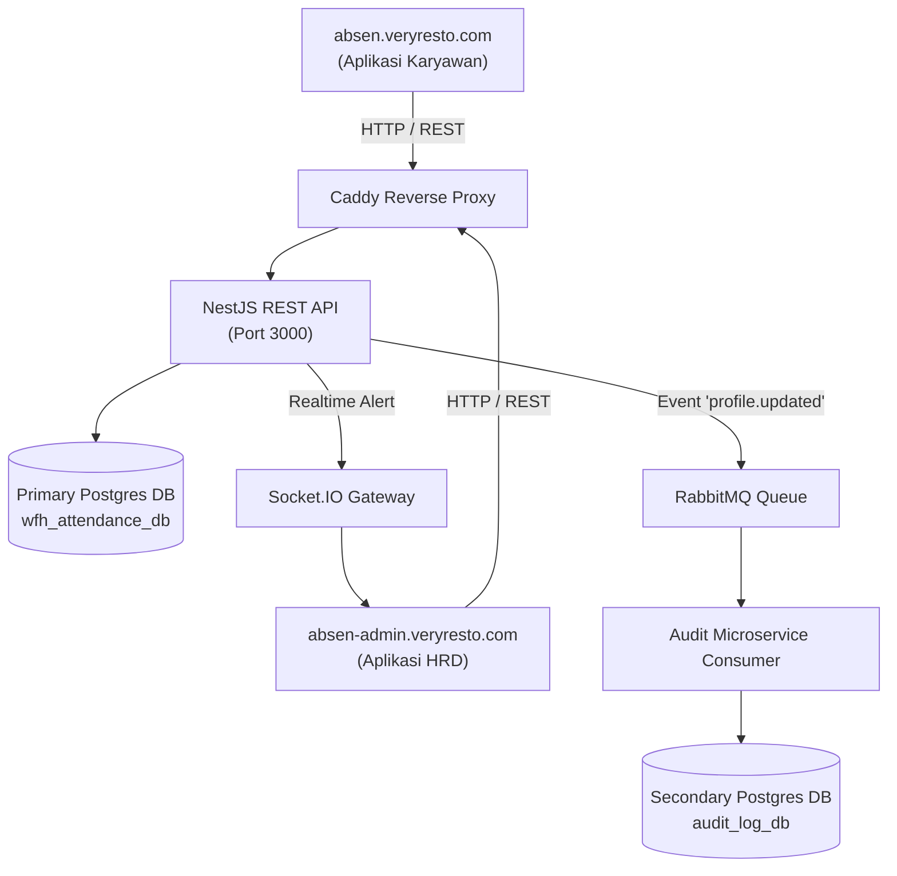

# VeryResto Fullstack Employee WFH Attendance & HR Monitoring System

Sistem Manajemen Absensi WFH Karyawan dan Monitoring HRD berbasis Microservices, NestJS, React.js, PostgreSQL, RabbitMQ, dan Socket.IO.

Sistem ini dapat diakses secara langsung melalui domain:
- **`http://absen.veryresto.com`** (Aplikasi WFH Karyawan)
- **`http://absen-admin.veryresto.com`** (Aplikasi Monitoring HRD)

---

## 📋 Fitur Utama

### A. Aplikasi Absensi WFH Karyawan (`absen.veryresto.com`)
1. **Profil Karyawan**:
   - Menampilkan Nama, Email, Foto, Posisi, dan No. HP.
   - Mengubah Foto, No. HP, dan Password.
   - **Realtime Admin Alert**: Notifikasi instan via WebSockets ke aplikasi Admin HRD saat terjadi perubahan data profil.
   - **Data Stream / Message Queue**: Logging audit ke database sekunder terpisah via RabbitMQ.
2. **Absen**:
   - Fitur Absen Masuk dan Absen Pulang kantor secara WFH dengan pencatatan Tanggal, Waktu, dan Status.
3. **Summary Absen**:
   - Menampilkan ringkasan kehadiran (Default: Awal Bulan s/d Hari ini).
   - Filter tanggal (*From - To*) dan tombol pencarian ("Cari").

### B. Aplikasi Monitoring Karyawan HRD (`absen-admin.veryresto.com`)
1. **Real-time Profile Alert**: Popup/Toast Notifikasi otomatis muncul di layar Admin secara instant saat ada karyawan yang mengubah profil.
2. **Kelola Data Karyawan**: Tambah karyawan baru dan perbarui informasi karyawan existing.
3. **Monitoring Absensi (Read-Only)**: Melihat seluruh rekapan absensi masuk & pulang semua karyawan dengan filter tanggal dan nama.
4. **Audit Log Queue Stream**: Melihat log aktivitas perubahan profil yang ditangkap dari RabbitMQ di secondary database.

---

## 🔑 Kredensial Login Default

| Role | Domain | Email | Password |
|------|--------|-------|----------|
| **Admin HRD** | `absen-admin.veryresto.com` | `hr.admin@veryresto.com` | `Password123!` |
| **Karyawan 1** | `absen.veryresto.com` | `budi.santoso@veryresto.com` | `Password123!` |
| **Karyawan 2** | `absen.veryresto.com` | `siti.aminah@veryresto.com` | `Password123!` |
| **Karyawan 3** | `absen.veryresto.com` | `dewi.lestari@veryresto.com` | `Password123!` |

---

## 🏗 Arsitektur Sistem



> 📖 **Dokumentasi Lengkap:**
> - [Dokumentasi Database & Schema ERD](docs/database.md)
> - [Dokumentasi Arsitektur Microservices & Flow](docs/architecture.md)

---

## 🛠 Panduan Jalankan Aplikasi

### 1. Prasyarat System
- Node.js >= 20
- Docker & Docker Compose

### 2. Jalankan Database & Messaging Services
```bash
docker compose up -d
```
Service yang berjalan:
- Primary Postgres: `localhost:5432` (`wfh_attendance_db`)
- Secondary Postgres: `localhost:5433` (`audit_log_db`)
- RabbitMQ: `localhost:5672` (Management: `localhost:15672`)

### 3. Setup & Jalankan Backend API
```bash
cd backend
npm install
npm run prisma:generate
npm run prisma:push
npm run seed
npm run test      # Jalankan unit test
npm start         # Start backend API & RabbitMQ consumer
```

### 4. Setup & Jalankan Frontend Applications
```bash
# Employee App (absen.veryresto.com)
cd frontend/employee-app
npm install
npm run preview -- --host 0.0.0.0 --port 3001

# HR Admin App (absen-admin.veryresto.com)
cd frontend/hr-admin-app
npm install
npm run preview -- --host 0.0.0.0 --port 3002
```

---

## 🧪 Pengujian Unit Test

Unit test backend dapat dijalankan dengan perintah:
```bash
cd backend
npm run test
```
Test suite mencakup pengujian logika bisnis Absensi (`attendance.service.spec.ts`) dan pembaruan profil & pengiriman event RabbitMQ/WebSocket (`employees.service.spec.ts`).
