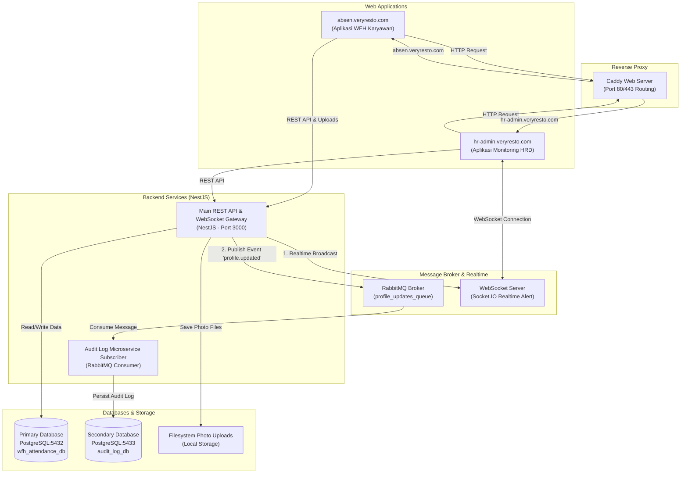

# Dokumentasi Arsitektur Sistem

Aplikasi **VeryResto WFH Attendance & HR Monitoring** dirancang menggunakan arsitektur **Microservices** dengan REST API, WebSockets (Socket.IO) untuk notifikasi real-time, serta Message Queue (RabbitMQ) untuk pencatatan audit log ke database sekunder.

---

## 1. Diagram Arsitektur (Mermaid)



---

## 2. Alur Perubahan Data Profil Karyawan (Flow Requirement 3.A.1 & 3.A.2)

Ketika Karyawan memperbarui data profilnya (Foto, Nomor HP, atau Password):
1. **Frontend App (`absen.veryresto.com`)** mengirim permintaan `PATCH /api/employees/me` dengan data baru dan opsional file foto.
2. **Backend API (`backend`)**:
   - Menyimpan file foto ke dalam sistem berkas lokal (`uploads/photos/`).
   - Memperbarui data pengguna pada **Primary Database (`wfh_attendance_db`)**.
   - **Requirement 3.A.1 (Popup Alert Realtime)**: Memancarkan event WebSocket (`employee_profile_updated`) ke **HRD Admin App (`hr-admin.veryresto.com`)**, yang langsung menampilkan notifikasi popup/toast di layar admin.
   - **Requirement 3.A.2 (Data Stream / Message Queue)**: Mempublikasikan event (`profile.updated`) ke antrean **RabbitMQ (`profile_updates_queue`)**.
3. **Audit Log Microservice Consumer**:
   - Menerima pesan dari antrean RabbitMQ secara asinkron.
   - Menyimpan payload log perubahan profil (sebelum & sesudah) ke **Secondary Database (`audit_log_db`)**.

---

## 3. Catatan Penyimpanan Objek / Storage (Notes Item #1)

Sesuai instruksi pengembangan, saat ini penyimpanan foto profil karyawan disimpan pada **Filesystem lokal** di direktori `./uploads/photos/`. 

```typescript
// TODO: Setup Object Storage (AWS S3 / GCP Cloud Storage / MinIO) untuk produksi
```
Dalam lingkungan produksi skala besar, layer penyimpanan lokal ini dapat diganti dengan AWS S3 atau Google Cloud Storage tanpa mengubah logika bisnis inti aplikasi.
