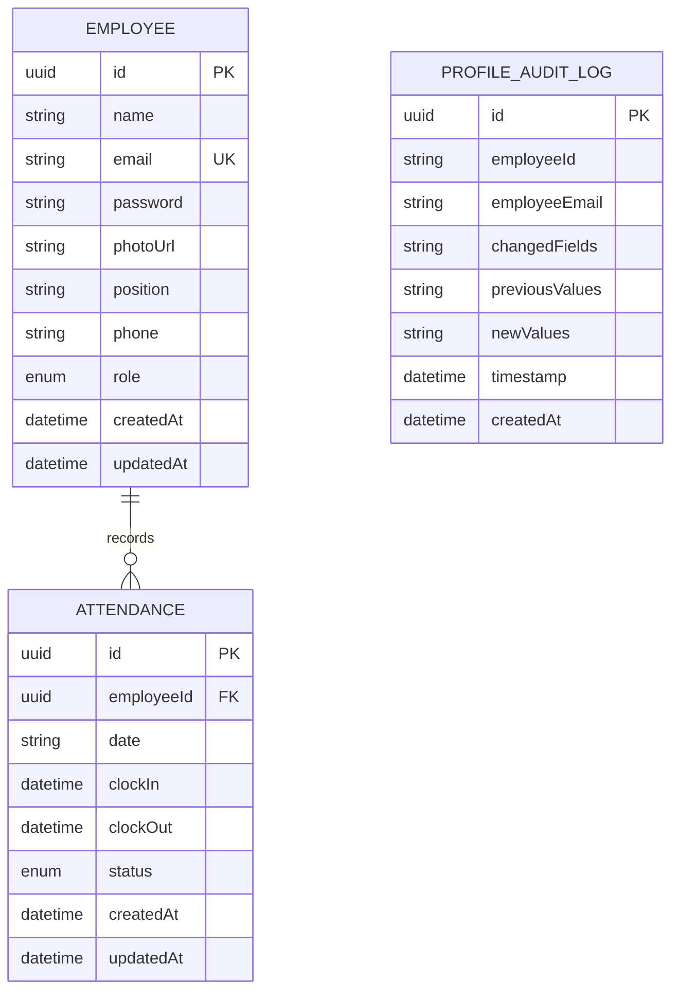

# Dokumentasi Struktur Database

Aplikasi ini menggunakan **dua database PostgreSQL terpisah** untuk memenuhi prinsip Microservices dan pemisahan data transaksi vs data audit logging.

---

## 1. Primary Database (`wfh_attendance_db`)

Database utama yang menyimpan informasi pengguna (karyawan & admin) serta transaksi absensi karyawan.

### Schema: `employees`
Tabel untuk menyimpan profil data karyawan dan admin.

| Column Name | Type | Constraints | Description |
|-------------|------|-------------|-------------|
| `id` | UUID | Primary Key | Identifier unik karyawan |
| `name` | String | NOT NULL | Nama lengkap karyawan |
| `email` | String | UNIQUE, NOT NULL | Email perusahaan (digunakan untuk login) |
| `password` | String | NOT NULL | Password terenkripsi (bcrypt hash) |
| `photoUrl` | String | Nullable | Path relatif foto profil karyawan di filesystem |
| `position` | String | NOT NULL | Jabatan / posisi karyawan |
| `phone` | String | NOT NULL | Nomor telepon / handphone |
| `role` | Enum (`EMPLOYEE`, `HR_ADMIN`) | Default: `EMPLOYEE` | Role akses aplikasi |
| `createdAt` | DateTime | Default: `now()` | Tanggal pendaftaran |
| `updatedAt` | DateTime | Auto Update | Tanggal pembaruan terakhir |

### Schema: `attendances`
Tabel untuk mencatat riwayat absensi masuk dan pulang karyawan.

| Column Name | Type | Constraints | Description |
|-------------|------|-------------|-------------|
| `id` | UUID | Primary Key | Identifier unik absensi |
| `employeeId` | UUID | Foreign Key -> `employees.id` | Reference ke ID karyawan |
| `date` | String (YYYY-MM-DD) | NOT NULL | Tanggal absensi |
| `clockIn` | DateTime | Nullable | Waktu presensi masuk |
| `clockOut` | DateTime | Nullable | Waktu presensi pulang |
| `status` | Enum (`MASUK`, `PULANG`) | Default: `MASUK` | Status presensi |
| `createdAt` | DateTime | Default: `now()` | Tanggal pembuatan |
| `updatedAt` | DateTime | Auto Update | Tanggal pembaruan terakhir |

---

## 2. Secondary Database (`audit_log_db`)

Database sekunder yang digunakan oleh **Audit Log Microservice**. Microservice ini menerima message event dari RabbitMQ Queue (`profile_updates_queue`) ketika ada perubahan profil karyawan (foto, nomor handphone, atau password).

### Schema: `profile_audit_logs`

| Column Name | Type | Constraints | Description |
|-------------|------|-------------|-------------|
| `id` | UUID | Primary Key | Identifier unik log audit |
| `employeeId` | String | NOT NULL | ID Karyawan yang mengubah data |
| `employeeEmail` | String | NOT NULL | Email Karyawan |
| `changedFields` | String (JSON Array) | NOT NULL | Daftar field yang diperbarui (misal `["phone", "photoUrl"]`) |
| `previousValues` | String (JSON Object) | NOT NULL | Record nilai sebelum perubahan |
| `newValues` | String (JSON Object) | NOT NULL | Record nilai setelah perubahan |
| `timestamp` | DateTime | Default: `now()` | Waktu saat perubahan terjadi |
| `createdAt` | DateTime | Default: `now()` | Waktu pencatatan log |

---

## ERD Diagram (Mermaid)

